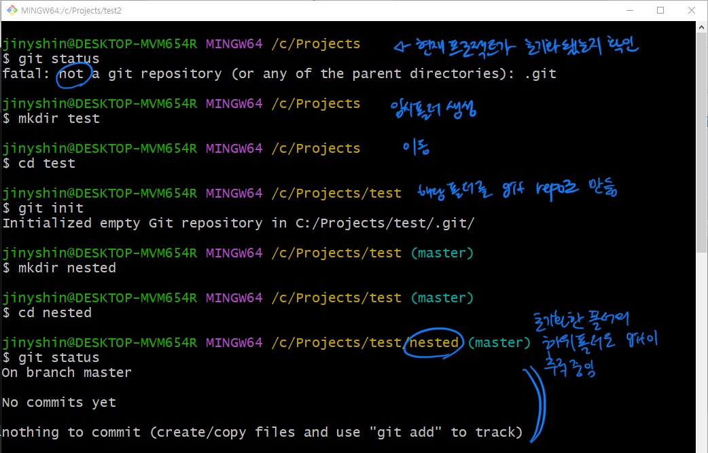
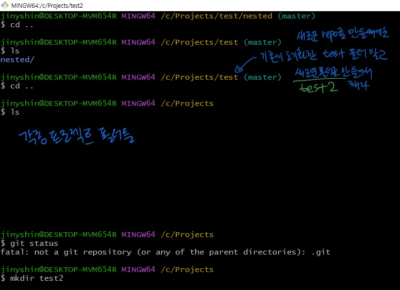
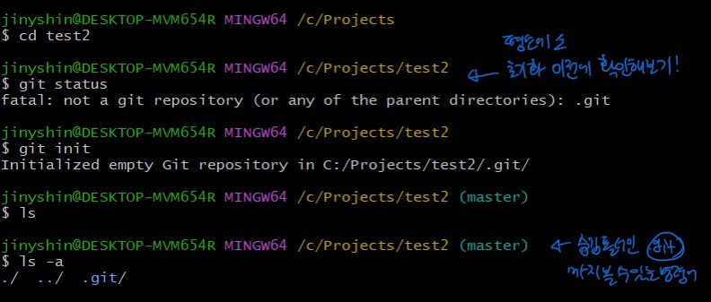

# Git 기초

- `git init`
  - git과 관련된 무슨일이든 하기 전에 must initialize a repo first!
  - 한 project당 1번씩만 하는 것이다.
- `git status`
  - 현재 repo에 대한 정보를 보여줌
- git init의 원리
  - .git 라는 숨김 폴더가 생김
    - 이 폴더 안에 git history가 저장됨
    - `ls -a`: 이 명령어를 수행하면 일반 `ls` 명령어와는 다르게 숨겨진 폴더까지 전부 확인할 수 있음. `.git` 폴더가 보이게 된다.
  - for test, 저 폴더를 삭제(`rm -rf .git`)한 후 `git status` 를 실행하면 빈 folder에서 git status명령을 수행했을 때와 똑같은 결과인 “not a git repository”가 나온다.
  - 깃 history가 있을때 `.git` 폴더를 삭제한다면…모든 자료가 날아가게 된다. 그래서 숨김 폴더인거지…!

# 흔한 실수 모음

- Do Not Init A Repo INSIDE of a Repo
  - Git Tracks a Directory and all nested Subdirectories
    - 기존 리포지토리 안에서 또다시 새로운 리포를 초기화(git init) 하지 마라.
    - ⇒ 그러기 위해 항상, **git init을 실행하기 전에 git status를 먼저 사용해서 내가 지금 repo안에 있지 않은지를 확인해라.**
    - 엄청 큰 일이 나는 것은 아니지만… 깃은 repo 안의 모든 것을 추적하기 때문에 이렇게 한다면 깃이 깃을 추적하게 되고..헷갈릴 것이다. ⇒ 그니까 하지 마라!
  - 보통 어떤 프로젝트를 위해 폴더를 만들면 그 폴더 안에서 깃을 초기화하는 것이 일반적인 원칙이다.

