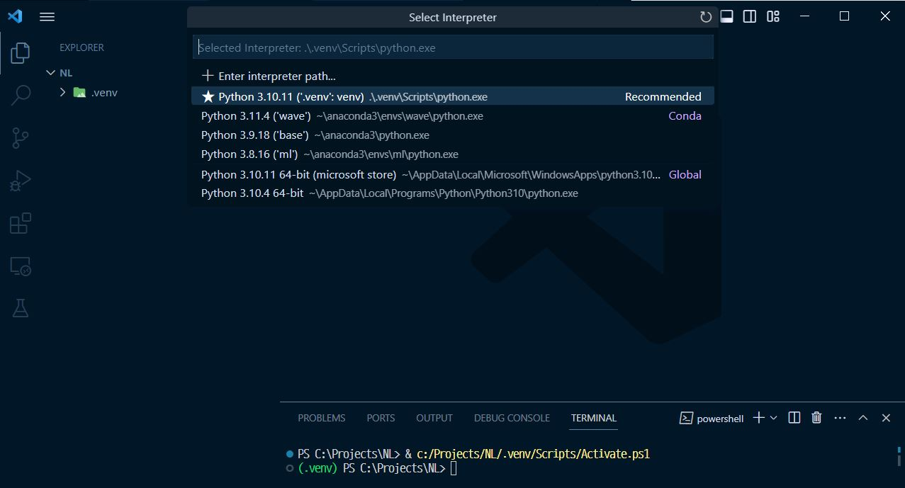

# Visual Studio Code 공식문서

## Getting Started with Python in VS Code
- [원본 글 링크](https://code.visualstudio.com/docs/python/python-tutorial)
- 프로젝트 세팅 과정 중 필요한 부분만 따로 정리

### Prerequisites

- Python3, VS Code, VS Code Python extension

### Start VS Code in a workspace folder

- 어떤 폴더에서 VS Code를 시작하면 그 폴더는 나의 "workspace"가 되는 것이다.
- 폴더 생성 후 그 폴더에서 VS Code open

### Create a virtual environment

- Python 개발자들의 best practice는 project-specific한 가상환경을 사용하는 것이다.
- 일단 그 가상환경을 활성화하면, 그 곳에서 install한 패키지들은 global interperter환경을 포함한 다른 환경과 분리된다.
  - 패키지 버전 충돌로부터 발생하는 복잡성을 줄여줌
  - Venv나 아나콘다를 사용해서 가상환경을 만들 수 있다.
- Open the Command Palette (Ctrl+Shift+P)
  - Python: Create Environment를 타이핑해서 선택해라
  - 커맨드 팔레트는 환경의 종류들을 보며주는데, Venv로 해보자
    - 인터프리터 선택하기(Python: Select Interpreter command from the Command Palette.)
      - 이미 설치해둔 것 중에 선택!
        

### Configure and run the debugger
- 참고: VS Code는 모든 configurations에 JSON 파일들을 사용한다; launch.json은 debugging configuration을 포함하는 파일의 표준 이름이다.